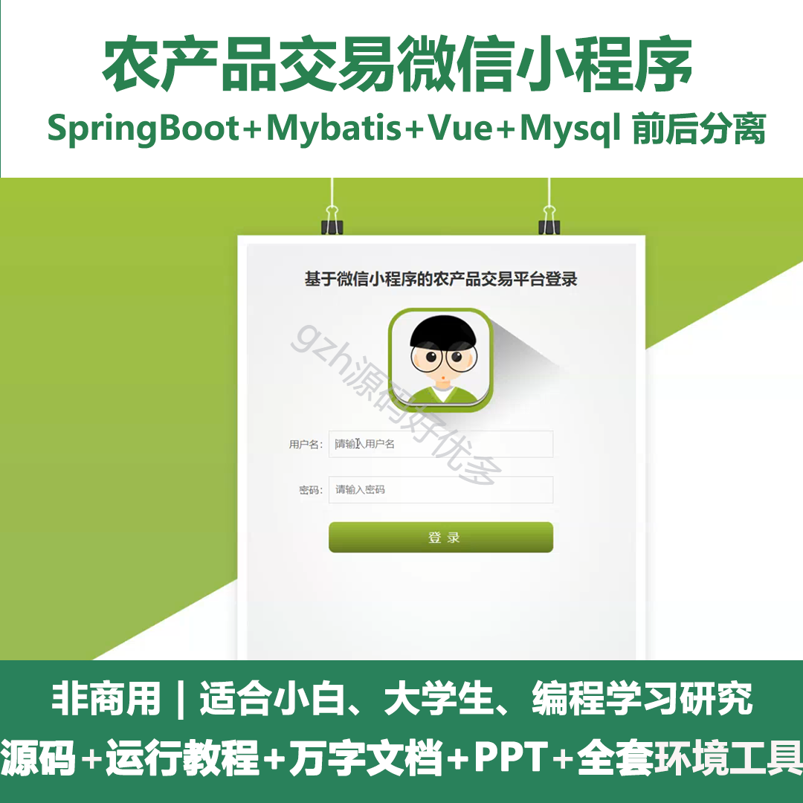
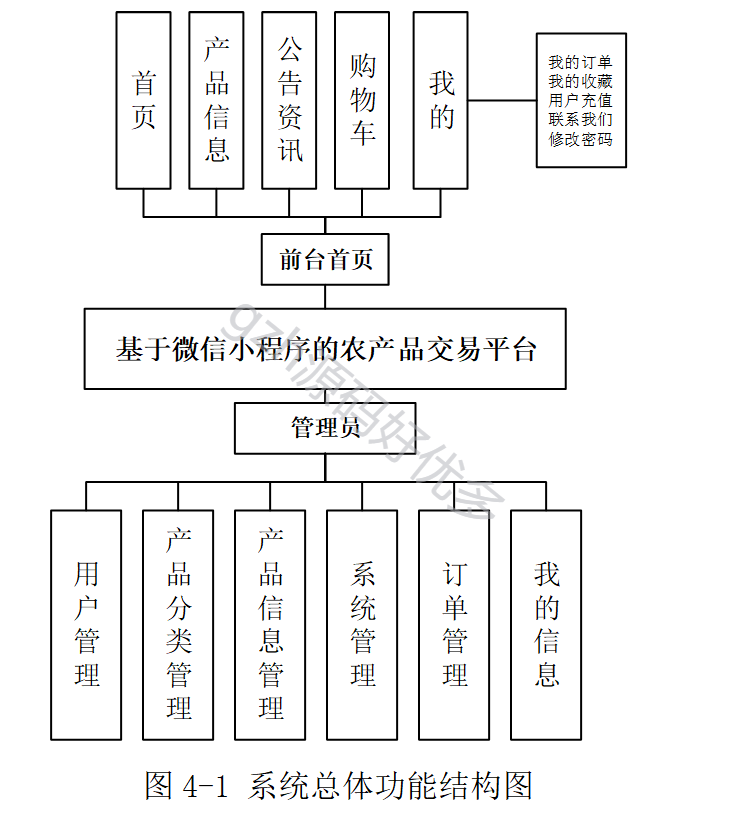
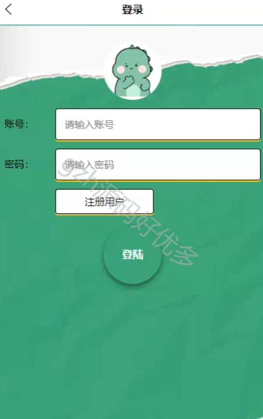
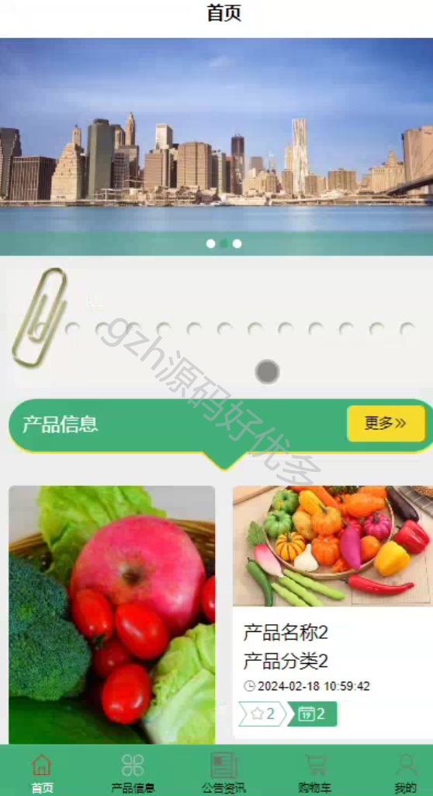
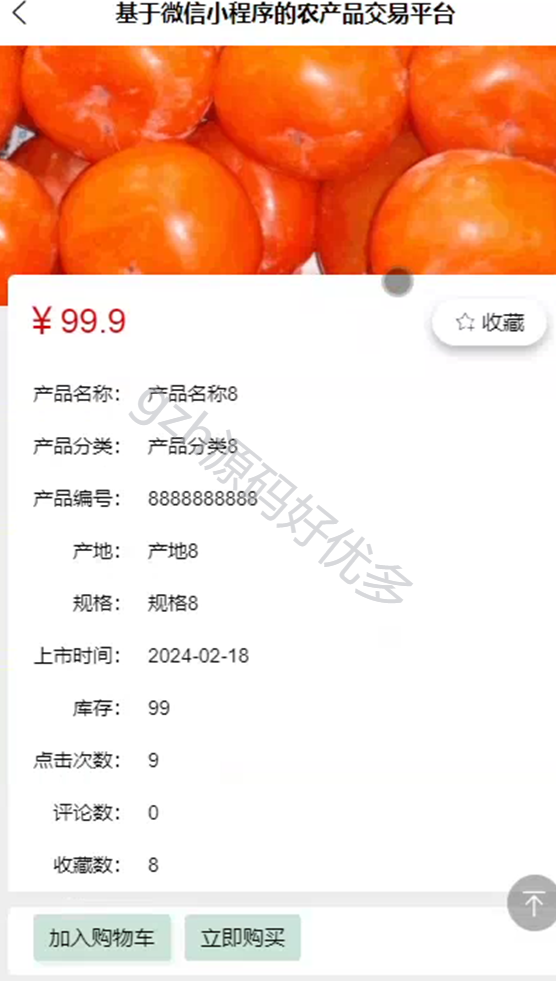
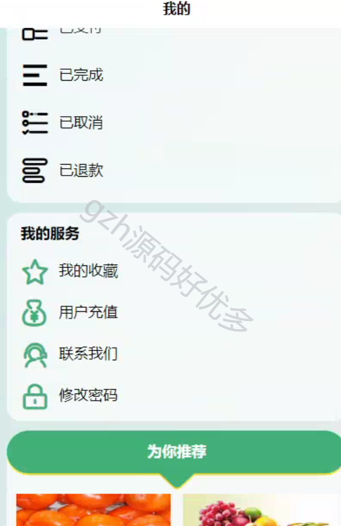
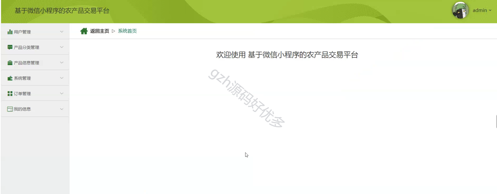
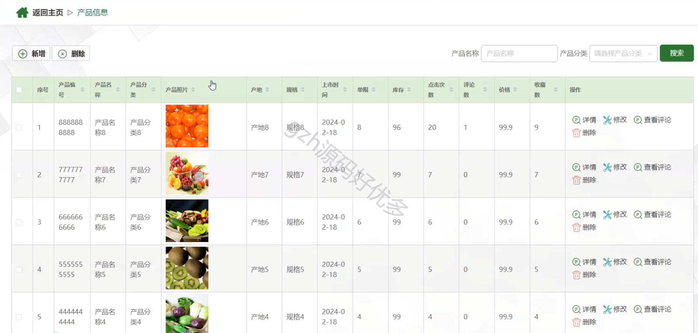
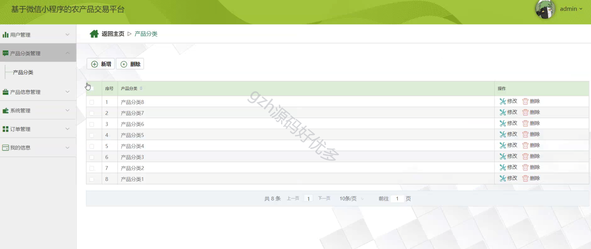
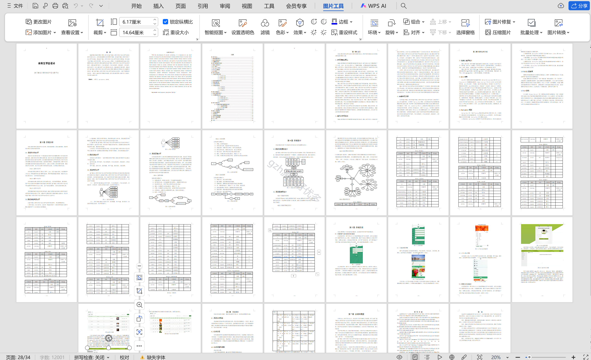

# mpweixinA059
mpweixinA059农产品交易微信小程序LW+PPT
 
## 查看主页获取源码

### 一、作品包含

源码+数据库+设计文档万字+PPT+全套环境和工具资源+部署教程

### 二、项目技术

前端技术：Html、Css、Js、Vue、Element-ui、Uniapp

数据库：MySQL

后端技术：Java、Spring Boot、MyBatis

  

### 三、运行环境

开发工具：IDEA/eclipse + HBuilderX + 微信开发者工具

数据库：MySQL5.7

数据库管理工具：Navicat10以上版本

环境配置软件： JDK1.8+Maven3.6.3

前端Nodejs：14

### 四、项目介绍
项目编号：mpweixinA059

微信小程序农产品交易平台在解决传统农产品交易困境、提高交易效率、促进信息透明度、降低交易成本以及推动农业产业升级等方面具有重要意义。随着技术的不断发展和用户需求的不断变化，该领域的研究将持续深入，并为农产品交易带来更多创新和便利。

本系统分为两大模块——管理员模块和用户模块。通过这些模块可以完成以下的基本功能：
管理员功能：用户管理、产品分类管理、产品信息管理、系统管理、订单管理、我的信息。
用户功能：下单、购物车、我的订单、我的收藏、用户充值、联系我们、修改密码等等。

### 五、运行截图

  
